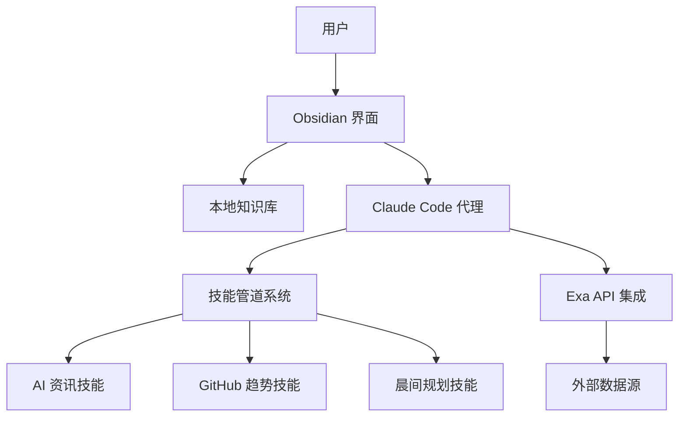

# 示例AI助手项目

## 🎯 项目背景

开发一个基于 Obsidian 和 Claude Code 的智能助手系统，实现知识管理的自动化和智能化。

**核心价值**:
- 将静态知识库升级为动态智能系统
- 减少手动整理时间，提高知识利用效率
- 探索 AI 代理与个人知识管理的结合模式

## 📊 项目概况

| 项目信息 | 详情 |
|---------|------|
| **项目类型** | 软件开发 |
| **技术栈** | Obsidian, Claude Code, TypeScript, Exa API |
| **项目周期** | 2026-03-01 ~ 2026-04-30 |
| **当前阶段** | 设计阶段 |
| **负责人** | 示例用户 |

## 🏗️ 系统架构

### 核心组件
1. **知识存储层** - Obsidian 本地知识库
2. **智能代理层** - Claude Code 技能系统
3. **数据集成层** - Exa API + 第三方数据源
4. **用户界面层** - Obsidian 插件 + Web 面板

### 技术架构图

## 📋 行动规划

### 阶段一：需求分析与设计 (2026-03-01 ~ 2026-03-15)
- [x] **需求调研** (2026-03-03)
  - 分析用户现有工作流痛点
  - 收集功能需求和使用场景
- [x] **竞品分析** (2026-03-05)
  - 研究现有 AI 笔记助手工具
  - 分析技术架构和实现方案
- [ ] **系统架构设计** (进行中)
  - 设计组件交互接口
  - 确定数据流和存储方案
- [ ] **技术选型确认** (待开始)
  - 评估不同 AI 代理框架
  - 选择数据集成方案

### 阶段二：核心功能开发 (2026-03-16 ~ 2026-04-10)
- [ ] **基础技能开发**
  - 晨间规划技能 (`/start-my-day`)
  - AI 资讯抓取技能 (`/ai-newsletters`)
  - GitHub 趋势分析技能 (`/github-trending`)
- [ ] **Obsidian 集成**
  - 模板系统开发
  - 自动文件生成机制
  - 实时更新通知
- [ ] **数据管道建设**
  - Exa API 集成配置
  - 数据清洗和格式化
  - 缓存和去重机制

### 阶段三：测试与优化 (2026-04-11 ~ 2026-04-25)
- [ ] **功能测试**
  - 单元测试和集成测试
  - 用户场景模拟测试
- [ ] **性能优化**
  - 响应时间优化
  - 资源使用优化
- [ ] **用户体验改进**
  - 交互流程简化
  - 错误处理和提示优化

### 阶段四：部署与文档 (2026-04-26 ~ 2026-04-30)
- [ ] **部署准备**
  - 配置脚本和安装指南
  - 环境变量管理方案
- [ ] **文档编写**
  - 用户使用手册
  - 开发者贡献指南
  - API 文档
- [ ] **发布准备**
  - 开源许可证选择
  - 发布说明撰写

## 📈 进展更新

### 2026-03-04
- 完成需求分析文档
- 确定了核心功能范围
- 与潜在用户进行了访谈

### 2026-03-05
- 完成竞品分析
- 发现现有工具在 Obsidian 集成方面的不足
- 确定了技术差异化方向

### 2026-03-06 (今日重点)
- 完善系统架构图
- 设计技能间通信协议
- 开始技术选型评估

## 📁 相关文件

### 设计文档
- [[系统架构设计]]
- [[数据库设计]]
- [[API接口规范]]

### 研究资料
- [[AI代理技术研究]]
- [[Obsidian插件开发指南]]
- [[Claude Code使用经验]]

### 会议记录
- [[项目启动会]]
- [[技术方案评审会]]

## 🎯 成功指标

### 技术指标
- ✅ 系统响应时间 < 2秒
- ✅ 技能执行成功率 > 95%
- ✅ 数据更新延迟 < 5分钟

### 用户指标
- ✅ 每日活跃用户 > 80%
- ✅ 任务完成率提升 > 30%
- ✅ 用户满意度 > 4.5/5

### 项目指标
- ✅ 按时交付各阶段里程碑
- ✅ 代码质量评分 > 90%
- ✅ 文档完整度 > 95%

## ⚠️ 风险与应对

### 技术风险
1. **Claude Code API 变更**
   - 影响: 技能系统需要适配
   - 应对: 保持 API 版本跟踪，设计抽象层

2. **Obsidian 插件兼容性**
   - 影响: 不同版本兼容性问题
   - 应对: 测试主流版本，提供降级方案

### 项目风险
1. **需求范围蔓延**
   - 影响: 项目延期
   - 应对: 严格的需求评审和优先级管理

2. **技术依赖风险**
   - 影响: 第三方服务不可用
   - 应对: 设计备用方案和降级逻辑

## 🤝 团队协作

### 沟通渠道
- **日常同步**: 每日站会 (09:30)
- **技术讨论**: GitHub Discussions
- **文档共享**: Obsidian 共享库

### 协作工具
- **代码管理**: GitHub
- **项目管理**: Obsidian 看板
- **文档协作**: 共享 Markdown 文件

---

**最后更新**: 2026-03-06
**下次评审**: 2026-03-13
**项目状态**: 🟢 按计划进行